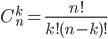
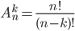

# Combination and permutation calculator

<h3>DEMO: https://innprogress.github.io/combination-and-permutation-calculator/</h3>

## Formulas
### Combination:

### Permutation:

## Usage
Filling data:
- Fill 2 inputs <b>k</b> and <b>n</n> following by two simple rules (according to the formula you selected):
  - N number needs to be bigger than number K (If you are calculating combination)
  - N needs to be bigger or equal to K (If you are calculating permutation)
  

## Tasks
- [ ] Probably I should make it more comfortable to use, update calculation as user is still writing numbers in inputs without need to click outside of input to update the result

Also check out another calculator I created - [dispertion-calculator](https://github.com/InnProgress/dispertion-calculator)
